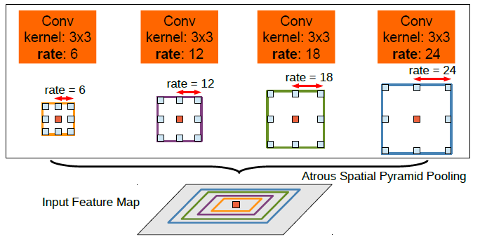
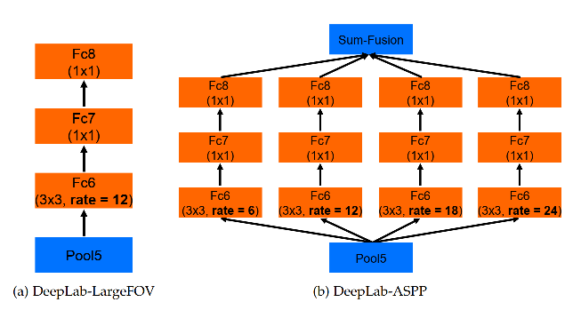

DeepLab系列语义分割模型进化过程梳理。

参考论文：

**DeepLabv1**： SEMANTICIMAGESEGMENTATION WITHDEEPCON-VOLUTIONALNETS ANDFULLYCONNECTEDCRFS

**DeepLabv2**： DeepLab: Semantic Image Segmentation with Deep Convolutional Nets, Atrous Convolution,   and Fully Connected CRFs

**DeepLabv3**：Rethinking Atrous Convolution for Semantic Image Segmentation

**DeepLabv3+**：Encoder-Decoder with Atrous Separable Convolution for Semantic Image Segmentation

#### DeepLab V1

Refer 0.0.1 SegBasics

DeepLab-LargeFOV是deeplab v1的一个variant。

#### DeepLab V2

deeplab v1和v2都是基于atrous conv以及CRF的，不同的在于：v2用了resnet的backbone，v1只用了vgg。另外，v2首次提出了**ASPP模块**。

对于32x的resnet，将最后两层的下采样改成r=2的dilated conv，从而使得最小的尺寸为8x，上采样只需要upsample 8倍，从而降低定位损失。

**ASPP（Atrous Spatial Pyramid Pooling）**的结构如下：

ASPP本质上还是一个SPP，即空间金字塔池化。在SPPnet中，SPP被用来将不同尺寸的ROI pool到同一个尺寸，用于后袖的训练；而在PSPNet中，也用到SPP的方法，但是是针对同样大小的feature map来获得不同尺寸（代表不同范围）的pooling结果，然后resize后拼接。ASPP用dilated conv的方式代替了常规的池化稠密的取average或max 的过程。

ASPP module的代码示例：

~~~python
import torch
import torch.nn as nn

class ASPP(nn.Module):
    def __init__(self, out_channels=256, dropout=0.1):
        super(ASPP, self).__init__()
        drop_rate = dropout
        dilation_rates = [6, 12, 18, 24]
        features = []
        for idx, dr in enumerate(dilation_rates):
            features.append(
                nn.Sequential(
                    nn.Conv2d(out_channels,
                            out_channels,
                            kernel_size=3,
                            stride=1,
                            padding=dr,
                            dilation=dr,
                            bias=True),
                    nn.ReLU(inplace=True),
                    nn.Dropout2d(p=drop_rate),
                )
            )
        self.features = nn.ModuleList(features)

    def forward(self, x):
        outs = []
        for f in self.features:
            outs.append(f(x))
        out = torch.cat(outs, dim=1)
        return out
~~~

deeplabv2和它之前的版本largeFOV的对比：

####DeepLab V3

####DeepLab V3+

