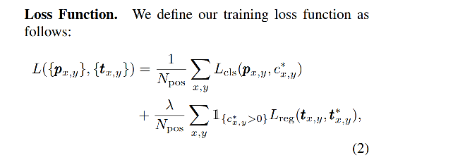
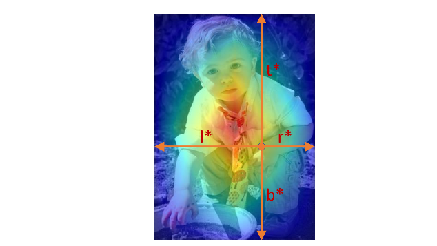

#### anchor-free 目标检测模型代表：FCOS（fully conv one-stage）

早期的目标检测模型一般分为二阶段、一阶段，代表分别为faster rcnn系列和yolo系列等。但是一般的模型都需要设定一定数量的anchor box，或者称为prior box（先验框），用来作为基准，使得回归过程变成针对特定anchor的回归。

anchor策略的pros & cons：

- 通过对每个grid回归多个anchor的策略，yolo同一个grid中有不同物体的问题可以得到缓解（可以被分配到不同的anchor）。

- 由于anchor是预先指定的，或者在数据集上聚类出来的，因此泛化性有限，换数据集or任务需要重新设计anchor。
- 以YOLO为例，只有中心点所在的grid才是正样例，其他在bbox内的非中心点都是负样例。比例不平衡。

为了解决anchor的遗留问题，考虑不使用anchor的方法，将bbox内的点都当成正样例，直接回归到边界的距离。

FCOS的基本原理：

类似UnitBox，采用IoU loss对框进行回归。bbox中的每个点回归它到上下左右四条边的距离。另外，考虑多尺度，设定一个尺度序列，将不同尺度的的bbox分配到不同尺度的feature map中区预测，这样可以解决重叠问题（同一个像素点在多个bbox内）。另外，考虑到真实的object不会充满整个bbox，越中间的位置越有效，因此，增加了centerness对objectness的score进行加权，降低边缘位置的重要性。（实际上相当于在全bbox与中心grid之间做了一个折中。）

FCOS的几个关键idea：

- 多尺度输出，区分重叠bbox内像素
- 直接预测到边界的距离，anchor freee。
- 考虑centerness，降低bbox边缘位置的（可能不是object）的权重。

网络结构：

多个head用来预测不同尺度的bbox。

FCOS的loss函数形式如下：

其中，cls loss采用了focal loss，reg loss采用了unitbox的iou loss。

centerness的公式为：

首先，分子和分母分别是两个方向（横向和竖向）的点到两边界的最小值和最大值，所以，当距离边界近的时候，min变小，max变大，靠近中心时，min和max基本能相等。也就是说，这个比例表示的是距离两边界的差距。差距越小，centerness越大。另外，加了sqrt是为了让变化变得更缓慢一些。

这个centerness变量需要再四个值 (lstar, rstar, tstar, bstar) 都预测出以后才能计算得到。实际计算中，是将centerness直接乘在预测的score上的，用来放大中间的权重。这样，bbox内的边缘的像素的score就降低了。在NMS时，它们所预测的bbox就能被比较容易第过滤掉了。

主要的作用示意图，可以看出去，加了centerness后，中间的作用被放大。

