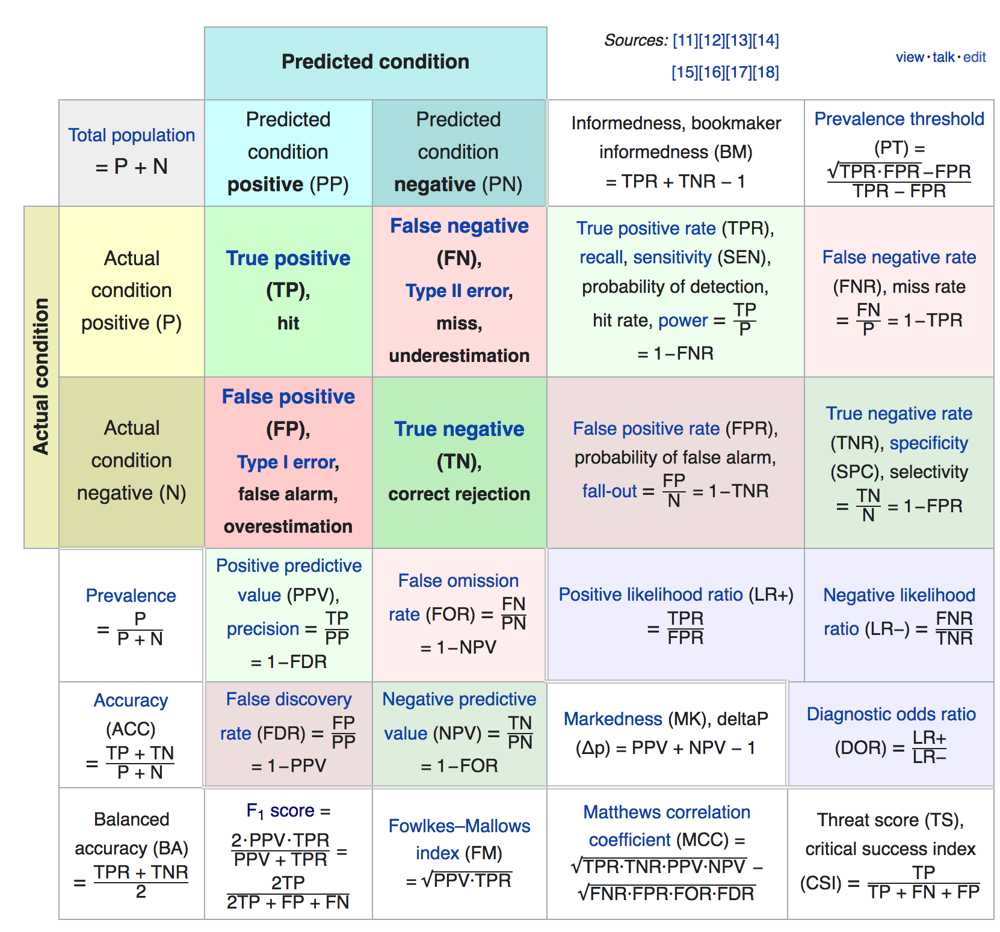
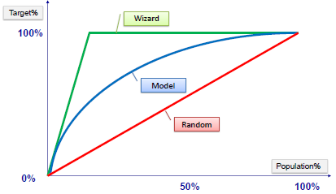
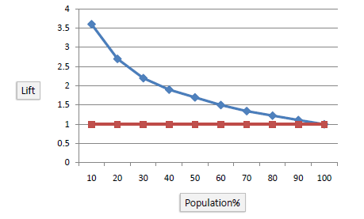

机器学习中模型评估中常用的指标。





对于二分类问题，考虑 TP/TN/FP/FN表示分类结果。其中T和F表示真实值与预测值是否相符；P和N表示**预测**结果为正或负。根据这两个标识即可判断在二分类table中的位置。


常用专名：

**Sensitivity**：敏感性，即**TPR（真正例率）**，其实就是**recall**，即召回率，计算公式：

**TPR = TP/(TP+FN)**

也就是预测为P的样本数占所有样本中真正的P样本的比例。用来考察所有的正样本中被捞回了百分之多少。1-TPR即为FNR，假负例率，即真实的P样本中有多少被错判为了N。

**Specificity**：特异性，即**1-FPR（假正例率）**，计算公式为：

**Specificity = TN/(TN+FP)**

特异性即真N样本中有多少被预测对了。FPR表示有百分之多少的负样本被错误地预测成了正样本。FPR在某些场景也被称为误诊率。

FP和FN实际上代表的就是统计推断中的第一类/第二类错误率（Type I / Type II error）

FPR和TPR在计算AUC时会被用到，这两个指标取消了实际的样本数量，都根据PN样本各自的规模归一化成为比例。


#### AUC

以FPR为横轴，TPR为纵轴，通过选择不同的阈值，可以做ROC曲线。具体操作如下：将预测结果以prob或者得分进行排序，然后从小到大选择阈值，记做thr，把所有大于thr的样本都判断为正，然后考察这些判断为正的样本中有多少TP，有多少FP（也就是被判错的负样本），用TP除以总的真实的P样本数，用FP除以总的真实的N样本数，就分别得到了TPR和FPR。不停调整阈值thr，即可得到一系列的TPR和FPR，画在坐标系中，由于是比例，因此范围在0-1之间。得到的即为ROC曲线。AUC为ROC曲线下的面积。

**AUC的理解**：横轴FPR，即代表某种代价，即将负样本也捎带着捞出来的代价。纵轴TPR，即我们的目标，即将正样本尽可能多的捞出来。所以AUC代表的是在同样的代价下，哪个模型可以更好地完成目标。优化AUC也就是希望能用更少的代价得到更好的想要的结果。

**AUC的优点**：用比例代替绝对值，和PR Curve相比，AUC对于样本不均衡的情况更加稳定。


#### KS

**KS Curve**，KS曲线，又称 **洛伦兹曲线**。KS曲线实际上就是把ROC曲线的那个“隐变量”thr作为横轴，然后TPR和FPR分别作为纵轴进行作图，从而可以看出随着thr增加，TPR和FPR的变化趋势以及两者之间的关系（差距）。

一个好的模型应该在thr确定的情况下，TPR和FPR有较大的差值，因此KS将max(TPR(thr) - FPR(thr))作为衡量标准，称为KS值。直观上来说，KS值就是KS曲线上两曲线相距最远的那个距离（同一个thr）。

KS曲线在风控建模场景有很重要的作用。因为一个风控策略所放进来的好客户和坏客户的差距直接影响到最终的收益。如果以牺牲一部分好客户（通常视为负样本）为代价，可以屏蔽掉更多的坏客户（正样本），那么最终在收益上不一定都是负向的。因此，KS关注的是某个thr下的极值，这个极值就是模拟实际应用中的准入边界。这一点和AUC评估模型的整体效果侧重不同。


#### Gini系数

Gini系数即AUC在45°线上面的部分的面积，可以直接从AUC换算过来：

**Gini = 2 × AUC  -  1**


#### Gain / CAP（Cumulative Accuracy Profile）/ AR（Accuracy Ratio）

Gain和后面的Lift都是衡量有没有模型对于预测效果的提升的，CAP和AR的叫法似不太常见，从定义上来看和Gain曲线相同。



Gain曲线的作图方式如下：首先，对所有预测结果排序，然后，设置不同的阈值thr，即百分比，此时的百分比表示的是大于thr的预测为正样本的样本数占总样本数的比例，即

x = (TP + FP) / N

以此为横坐标，纵坐标为当前阈值下的precision，即

y = TP / (TP+FN)

如果没有模型，那么随机情况下，可以认为正负样本在每个percentage区间内都是均匀的，因此选出来的样本每多1%（和样本总数N相比），那么正样本就顺势多了1%（相对于所有真的正样本）。所以，random情况下，Gain curve应该是斜率为1的线段。

考虑最优情况下，前面的都是真的正样本，那么，每多捞出1%（相对于N）的样本，则y就会多1/m %（m为数据集中的正样本比例，相对于所有正样本）。这里的斜率是因为判断为正的样本都是真的正样本，数量一样，但是分母不同（一个为Npos，一个为N）。并且，随着percentage增加，在某个时刻，正样本全部被召回，剩下的都是真负样本，此时curve斜率为0，保持在100%。

AR为对应的curve和random curve之间的面积。

note：Gain curve和ROC有些类似，这里进行简单比较：

**ROC和Gain curve都是以一定阈值下召回多少正样本为目标（y坐标），不过ROC的代价（x轴）是FPR，即不小心捞回的负样本的比例（与全部负样本相比），而Gain的代价是总共圈出/选出了多少比例的总样本（与全部样本数比较）。**


#### Lift



Lift指标和Gain类似，也是通过比较有无模型的区分程度的提升来度量模型的。Lift相当于把Gain curve与random Gain curve 相除，结果就是Lift，即Lift表示在当前选择的百分比之下，通过模型筛出来的正样本的比例（相对于样本集中所有正样本）比随机猜的结果要高多少倍，这个倍率就是模型的效果。


#### mAP

目标检测常用指标，全程mean Average Precision，这里的mean指的是对所有类别求均值（mean），Average指的是对于所有的recall的要求计算precision的平均值。

对于某个类别的AP，实际上就是计算**PR曲线下面积**。在实现过程中，需要首先确定TP/FP/FN，由于检测问题的输出是bbox，一般设定0.5的IoU为阈值，预测的bbox和gt bbox的IoU大于0.5的，则认作TP，小于0.5的，视为FP，在所有与的gt中，没有被检出的gt bbox，视为FN。由于检测问题实际上是一个retrieval任务，只有正样例，因此无需计算TN，所有的无框的其实本质上都是Negative。

确定了TP/FP/FN后，即可对所有预测结果按照预测的score排序，依次设定阈值（即设定cutoff位置），选择top部分计算precision和recall（这里的precision和recall只对大于该cutoff，或rank的那些样本进行计算。计算完成后，得到PR curve，**为了保证PR curve单调递减，可以采取插值操作，即对于每个recall下的precision，令其等于大于等于该recall下的precision的最大值。**

早期PASCAL VOC challenge 采用**11 point interpolation**，即选择recall = 0.1, 0.2, …, 1.0共11个点时的precision，进行插值求平均。现在采用则是上述的全样本计算方法。


#### IoU/mIoU/FWIoU

同样，m表示各类别的mean，FW表示freq weighted，即根据不同类别的频率值加权，从而多数类的影响更大。IoU为intersection over union，IoU在检测和分割中都常用，对于检测和分割的计算方法分别如下：


目标检测bbox iou计算：

只要了解两条线段之间的部分是由左边点的最大值和右边点的最小值构成的，即可写出。

```python
class BBOX_XYXY:
    """
    bbox with (x1, y1, x2, y2) format
    (x1, y1) and (x2, y2) represents bottom-left and top-right points
    """
    def __init__(self, coords):
        try:
            x1, y1, x2, y2 = coords
        except:
            raise TypeError('coords should be 4-tuple, got {}'.format(coords))
        self.bottom_left = (x1, y1)
        self.top_right = (x2, y2)
        assert x2 > x1 and y2 > y1
        self.area = (x2 - x1) * (y2 - y1)

def cal_bbox_iou(bbox1, bbox2):
    """
    bbox1 and bbox2 are two b-boxes impel. using BBOX_XYXY class
    """
    W = min(bbox1.top_right[0], bbox2.top_right[0]) - max(bbox1.bottom_left[0], bbox2.bottom_left[0])
    H = min(bbox1.top_right[1], bbox2.top_right[1]) - max(bbox1.bottom_left[1], bbox2.bottom_left[1])
    if W <= 0 or H <= 0:
        return 0
    intersect = W * H
    union = bbox1.area + bbox2.area - intersect
    iou = intersect / union
    return iou
```


语义分割 iou计算：

一个简单的实现是将pred和label转为bool值，直接用logical ops实现求intersection和union。

```python
def cal_segmap_miou(label, pred):
    """
    calculate segmentation miou
    pred means predicted pixel-wise probs
    label is binary
    """
    pred[pred <= 0.5] = 0
    pred[pred > 0.5] = 1
    bool_label = label.astype(bool)
    bool_pred = pred.astype(bool)
    intersect = bool_label * bool_pred
    union = bool_label + bool_pred
    iou = intersect.sum() / float(union.sum())
    return iou
```


