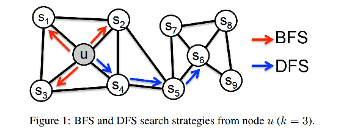
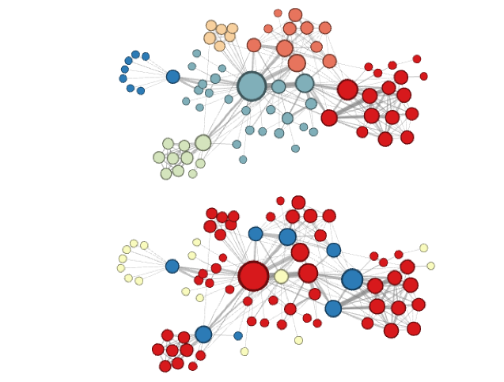
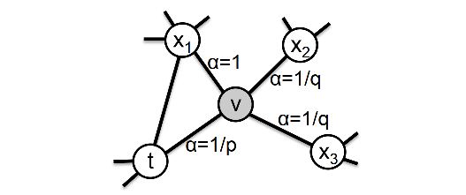

基于node2vec的词嵌入

node2vec的关键点：

- 考虑同质性和结构等价性。
- 通过设置p和q两个参数，控制下一步返回还是向远处走，从而调节BFS和DFS的倾向。

> ref：[node2vec: Scalable Feature Learning for Networks](https://cs.stanford.edu/~jure/pubs/node2vec-kdd16.pdf)

node2vec的主要特点是兼顾了BFS和DFS，改进了deepwalk中的游走策略。

首先，node2vec首先提出了一个观点：对于图嵌入问题，我们应该考虑node的什么特性？对于一个node来说，两个特性需要关注，一个是**同质性（homophily）**，一个是**结构等价性（structural equivalence）**。简单来说，同质性表示的是这组节点是否在一个范围，而结构等价性表示的是两个节点是否处在类似的结构当中。举例如图：

上面的相同颜色表示的就是同质性强的nodes，下面则表示结构等价性。可以看出，同质性强的离得一般较近，而结构等价性强的，则可能离得比较远，但是周围的连接的分布（比如是中心点还是边缘）特征是相似的。

我们希望具有这两种相似性的都能在embedding的过程中被编码到相近的位置。但是对于deepwalk来说，random walk取sequence是完全随机的，因此不会考虑到这两种相似性的问题。不过，传统的图搜索算法BFS和DFS其实可以对应到这两种相似性。具体如下：

- **BFS对应结构等价。**原因：BFS可以将周围的信息尽可能的与目标node放在一起组成sequence。这就类似于自然语言中的一个句子里，如果有个两个单词经常出现在某个固定的句式或词组中，那么，可以推测他们的意思比较相近。
- **DFS与同质性等价。**原因：DFS可以走到更远的有路径相连的node，从而可以探索更大的邻居空间，不但找到直连的邻居，也能找到间接相连的邻居。

**node2vec是如何结合起来BFS和DFS呢？**

如图，这里表示从t到达了v以后，下一步的概率分布。alpha控制着各个方向的概率，其公式为：

可以看出，p控制的是返回t的概率，也就是更偏向BFS，即只在t附近活动。而q控制的是走向远处的概率，更偏向DFS，即远离出发点。

因此，node2vec可以通过参数选取，合理的控制网络更倾向于表达同质性还是结构一致性。

