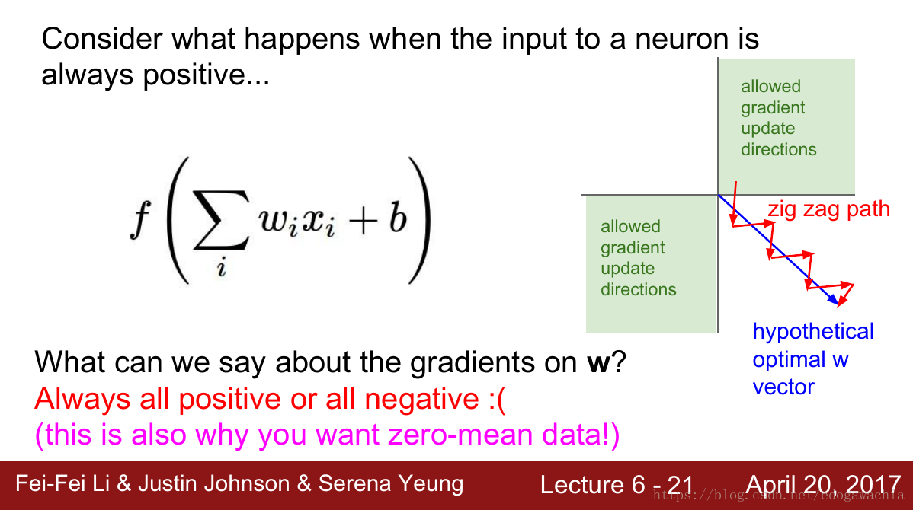
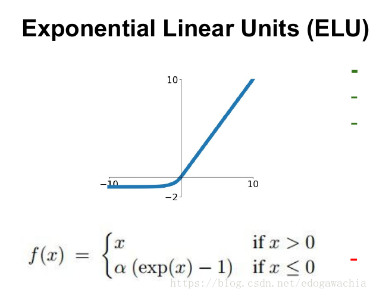
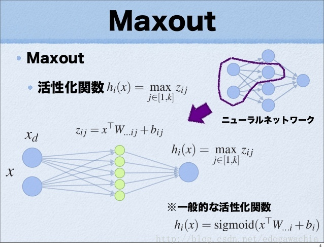
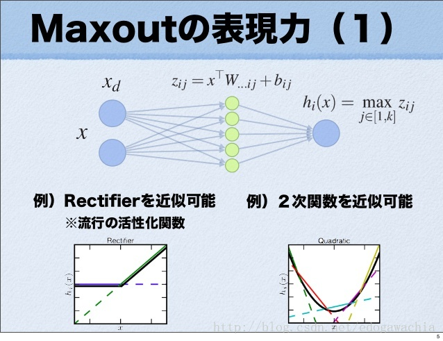
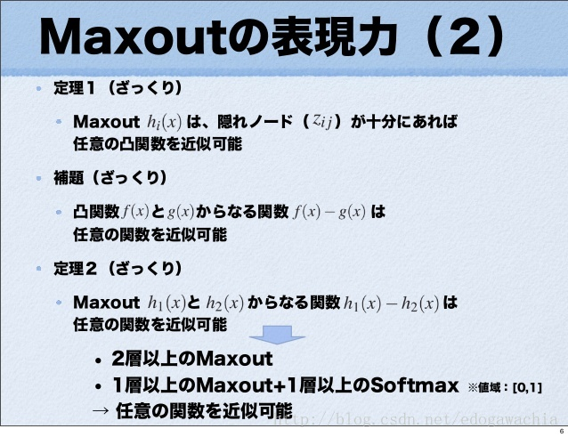

神经网络激活函数汇总（Sigmoid、tanh、ReLU、LeakyReLU、pReLU、ELU、maxout）

####sigmoid

定义：

$Sigmoid(x) = \frac{1}{1+\exp(-x)}$

特点：可以解释，比如将0-1之间的取值解释成一个神经元的激活率（firing rate）

缺陷：

- 有**饱和区域**，是软饱和，在大的正数和负数作为输入的时候，梯度就会变成零，使得神经元基本不能更新。
- 只有正数输出（不是zero-centered），这就导致所谓的**zigzag现象**。
- **计算量大（exp）**。

#### tanh

tanh函数定义如下：

$\tanh(x) = \frac{\sinh(x)}{\cosh(x)} = \frac{\exp(x) - \exp(-x)}{\exp(x)+\exp(-x)}$

tanh和sigmoid函数是具有一定的关系的，可以从公式中看出，它们的形状是一样的，只是尺度和范围不同。

tanh是zero-centered，但是还是会饱和。

####ReLU and variants

####ReLU

CNN中常用。对正数原样输出，负数直接置零。在正数不饱和，在负数硬饱和。relu计算上比sigmoid或者tanh更省计算量，因为不用exp，因而收敛较快。但是还是非zero-centered。

relu在负数区域被kill的现象叫做dead relu，这样的情况下，有人通过初始化的时候用一个稍微大于零的数比如0.01来初始化神经元，从而使得relu更偏向于激活而不是死掉，但是这个方法是否有效有争议。

####LeakyReLU

为了解决上述的dead ReLU现象。这里选择一个数，让负数区域不在饱和死掉。这里的斜率都是确定的。

####PReLU

parametric rectifier, p表示parameter，即参数的意思。

定义为：$f(x) = \max(x, \alpha x)$

但是这里的a不是固定下来的，而是可学习的。

####ELU

公式：

具有relu的优势，且输出均值接近零，实际上prelu和LeakyReLU都有这一优点。有负数饱和区域，从而对噪声有一些鲁棒性。可以看做是介于relu和LeakyReLU之间的一个东西。当然，这个函数也需要计算exp，从而计算量上更大一些。

####Maxout

maxout是通过分段线性函数来拟合所有可能的凸函数来作为激活函数的，但是由于线性函数是可学习，所以实际上是可以学出来的激活函数。具体操作是对所有线性取最大，也就是把若干直线的交点作为分段的界，然后每一段取最大。

maxout可以看成是relu家族的一个推广。

缺点在于增加了参数量。

maxout 简介

maxout 得名时因为它的 out put 是输入集合中的 max ，而且一般和dropout一起使用。论文作者提出 maxout 的本意就是设计一个 model 让它可以 leverage 作为 model averaging tech 的 dropout。而且论文作者经验性的证明了 maxout 和 dropout 一起可以对于优化和 model averaging 有效果。
maxout 作为新的激活函数

maxout 可以被视为一种新的激活函数。如图所示，一般的NN都是先对输入（x）进行加权求和（得到z）再输入进一个非线性函数h中，输出即为激活函数的值（h(z)）。而 maxout 不同，它去掉了后面的非线性函数，并且对于后一层的每个值，都相当于在前面加了一个 hidden layer，而且时没有 activation 的 hidden layer ， 而且从 hidden layer 到后一层的值之间并不是加权求和，而是取 max 。（这样看来其实也不能算作 hidden layer … 只是可能几何结构上有些类似，更应该看作 hidden layer 中的每一个 node 都相当于一个可能的 output ，如果只看某一种可能性的话，模型就退化成普通的 FC 层了。而最后的输出只不过是在所有可能的输出中取最大值）

在实现上，可以将x通过多个n到1的linear层，然后对这些输出求最大值。展示一个代码示例：

(Refer : https://gist.github.com/daskol/05439f018465c8fb42ae547b8cc8a77b)

~~~python
import torch as T

class Maxout(T.nn.Module):
    """Class Maxout implements maxout unit introduced in paper by Goodfellow et al, 2013.
    
    :param in_feature: Size of each input sample.
    :param out_feature: Size of each output sample.
    :param n_channels: The number of linear pieces used to make each maxout unit.
    :param bias: If set to False, the layer will not learn an additive bias.
    """
    
    def __init__(self, in_features, out_features, n_channels, bias=True):
        super().__init__()
        
        self.in_features = in_features
        self.out_features = out_features
        self.n_channels = n_channels
        self.weight = T.nn.Parameter(T.Tensor(n_channels * out_features, in_features))
        
        if bias:
            self.bias = T.nn.Parameter(T.Tensor(n_channels * out_features))
        else:
            self.register_parameter('bias', None)
            
        self.reset_parameters()
    
    def forward(self, input):
        a = T.nn.functional.linear(input, self.weight, self.bias)
        b = T.nn.functional.max_pool1d(a.unsqueeze(-3), kernel_size=self.n_channels)
        return b.squeeze()
    
    def reset_parameters(self):
        irange = 0.005
        T.nn.init.uniform_(self.weight, -irange, irange)
        if self.bias is not None:
            T.nn.init.uniform_(self.bias, -irange, irange)
    
    def extra_repr(self):
        return (f'in_features={self.in_features}, '
                f'out_features={self.out_features}, '
                f'n_channels={self.n_channels}, '
                f'bias={self.bias is not None}')
~~~

从上面的code可以看出，实现一个maxout类，只需要将一个普通的nn.Linear(in_ch, out_ch)变成nn.Linear(in_ch, out_ch \* k )， 其中k表示有几个数取最大，也就是线性拟合的line piece的数量。最后，再将得到的结果以 k 为kernel_size做pooling，即认为连续的每k个值为一组（对应最终的一个output value），然后对它们进行max操作即可。Linear和MaxPool也都是torch中自带的class，可以直接用来实现maxout。

maxout 的表达能力

对于每一个 x–>z 的映射，都是一个线性函数，因此最后取 max 实际上是对所有可能的线性函数取最大，因此会得到一个分段线性的激活函数，而且由于是取max，则分段函数必然是凸的，而且由于我们认为激活函数是凸的，那么如果给定足够多的分段，那么原则上 maxout 是可以拟合任意的激活函数的。下面展示的就是 maxout 拟合 ReLu 和 二次函数 的情形

下面是定理，用来说明 maxout 的表达能力，首先，定理一说明，只要隐节点足够多，任何凸函数都可以用 maxout 来近似，而后说明如果 f 和 g 时凸的，那么任意函数都能由 f - g 来近似。所以得到定理二，即 maxout 相减可以拟合任意函数。 所以多层的 maxout 具有很强的表现力。

由于 maxout 是 PWL (Piecewise Linear) 的，因此可以用BP更新。

这里写图片描述

reference:

> Goodfellow I J, Wardefarley D, Mirza M, et al. Maxout Networks[J]. Computer Science, 2013:1319-1327.
> 論文紹介 Maxout Network 斎藤淳哉 

