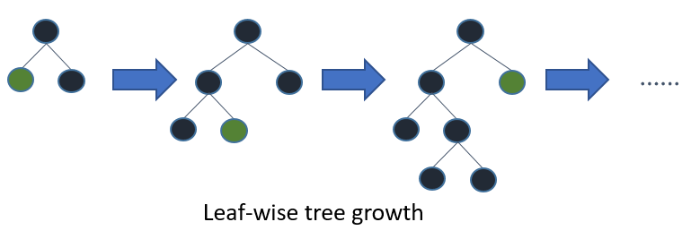
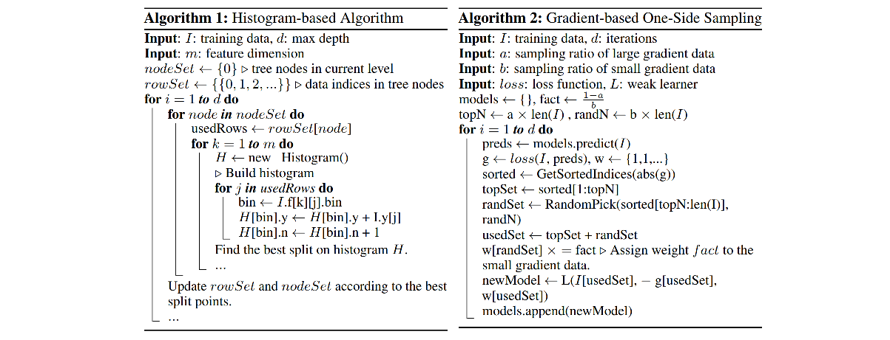

Xgboost、GBDT、lightGBM是对于特征类数据进行机器学习建模的常用模型，三者的基本思路都是基于树模型的梯度提升。相关内容整理如下：

**XGBoost原理与算法pipeline**

> Ref : Chen - Introduction to Boosted Trees (slides) （原网站挂了，copy→） [copy](./assets/Chen_Introduction_to_Boosted_Trees.pdf)

xgboost的基本思路是建立一个对于结构有约束的一系列树模型，从而使得模型在预测性与简单性之间进行折中。

简单来看，xgboost的目标函数为：

其中，l(y, yhat)表示训练误差，Omega是对于树的结构的约束。其中fk代表第k棵树。

首先，考虑boosting的特点，即additive training，第t个时刻的预测结果为第t-1时刻的结果加上第t时刻建立的树的输出。即：$y^t = y^{t-1} + f_t(x)$。将这个关系带入到上面的loss函数中，然后进行Taylor展开，如下：

可以看出，目标函数的loss（不包含regular部分）包括三个部分：当前的（t-1时刻）预测结果的误差、一阶导数项，二阶导数项。而当前误差已经是constant，无法通过当前的树ft进行优化，因此可以不关心（我们只保留含含有ft(x)的项）。最终的目标函数变成了：

要优化的自变量就是ft(x)的输出值，或者说就是新建的树的各个节点的输出值。如果不考虑正则项，前面的loss已经被化简成了ft的二次函数，而g和h分别是一次项和二次项的系数。

下面来看正则项Omega：

XGBoost中定义的正则项，即对树的结构的约束。具体包括：**树的叶子节点个数** and **叶子节点输出的l2范数**。

数学定义如下：

由于有叶子节点的二次项，因此这个需要与前面的loss部分的二次项合并，结果得到了：

相比于之前，一次项系数不变，二次项增加了lamba（正则化系数），并且多了个表示leaf node 数的常数项。

对于优化二次函数，根据初中数学即可知道，存在一个最值，在$x=-b/2a$处取到，最值为$-b^2/4a$。带入上面的参数，可以得到：

到此为止，就已经有一个指标可以度量新树的优劣了。在最优情况下，应该将所有的可能的树都列举出来，然后计算Obj，比较哪个更优（Obj更小）。然后确定下来，各个叶节点的值（weight）就是wj opt。但是，不可能对所有树进行枚举，因此，仍然以Obj为准则，进行greedy learning，即通常的叶子分裂。

XGBoost的gain函数如下定义，其准则就是上面的Obj（对应DT模型的信息增益、Gini系数等的作用）

实际上就是将不分裂的cost减去分裂后两课子树的cost，看看分裂的话cost下降多少，这个下降就是增益gain。最后，还要考虑gamma，因为分裂会增加叶子节点数量，增加树的复杂度。

到此，XGBoost的原理和算法流程就已经基本完成了。流程简单总结：

~~~python
for t in iterations:
    计算当前的yhat与真实y的loss，并对各个预测结果yhat_i求出一阶导数g和二阶导h。
    建立新树，通过预设的lambda、gamma以及当前的g和h计算增益Gain，用于决定是否分裂。
    达到设定层数、或者Gain小于零(prun)，完成建树，得到ft。
    将ft的叶子节点输出ft(x)合并到yhat上，得到新的yhat ← yhat + epsilon * ft(x)
end
~~~

一些其他问题：

1. 分类问题如何处理？one-hot化。
2. 如何实现样本加权？在计算loss和g的时候进行。
3. 如何实现剪枝？计算gain时，由于有gamma参数控制node数，因此可能小于0，即停止分裂，作为prune。
4. **如何处理缺失值？先不考虑缺失值，用其他有值的进行split，然后，尝试将缺失值划分到左子树或者右子树（需要记录下来），分别计算loss，选择使得loss更优的方案。在测试阶段，如果该feature训练时有缺失值，那么按照之前记录的结果进行划分（相当于吧缺失值也当成了一个特征）。如果训练时该feature没有缺失值，那么默认都划分到左子树。**

**XGBoost是如何实现和改进GBDT的？**

1. **二阶Taylor展开**，加速模型收敛。
2. **学习率**因子，有利于生成更多的树。
3. 加入显式**正则项**，在分裂时即考虑到树的复杂性。
4. 工程实现上，采用了**并行**策略。
5. 列下采样，**预排序（pre-sort）加速**。

**LightGBM的主要改进策略**

1. **直方图算法**，加速查找分割点效率
2. **单边梯度采样**，减少数量庞大的小梯度样本。
3. **leaf-wise生长策略**，建树效率高。
4. **互斥特征捆绑**，实现特征降维。
5. 支持**类别特征**（categorical）

关键点：

- 直方图的pros & cons：对特征进行分箱，只保存直方图。**存储空间降低，查找速度提高。但是分割点不精确。**由于DT本身是weak learner，加上boosting后分割点不精确的影响并不大。

- 对于树的每个节点直方图的计算，可以利用**子节点的直方图相加等于父节点的直方图**，进行加速。

- 限制层数的Leaf-wise 分裂生长策略，xgboost和普通的DT都是直接对一层的节点进行分裂，但是由于有的节点增益低，导致分裂低效。lightgbm采用leaf-wise方法，每次选择叶子节点中增益最大的，然后进行分裂，以此循环。

  

  

- 单边梯度采样（GOSS）。boost中一般需要根据预测的准确性对不同样本进行不同的加权操作。但是GBDT类算法没有该过程。为了衡量样本的难易，采用梯度进行衡量（梯度越大，自然对模型的贡献越大）。先将梯度排序，然后采头部的百分比为a的样本，然后在剩下的1-a中采占比为b（也是相对于总体的占比，而非1-a）的样本，由于将1-a中的采样了，因此对他们乘以(1-a)/b的权重，增加模型的关注。

- 特征捆绑（bundle）的方式是通过建立一个加权图，以特征为顶点，以冲突为权重，按照度进行排序，将特征分配给不同的bundle，是的总的冲突最小。merge的方法：加偏置后对直方图进行merge。

lightGBM中用到的几个算法的流程图如下：

【直方图算法】【单边梯度采样】【特征捆绑】【特征融合】

**XGBoost、GBDT与LightGBM的比较总结**

- GBDT是算法，XGB是GBDT改进后的一个实现。

- GBDT只用了CART树做base learner，XGB支持**多种基分类器**。

- XGB加入**显式正则**，将叶节点数目与范数加入考虑。控制复杂度，防止过拟合。

- XGB采用**二阶导数**，更好收敛。而GBDT只采用梯度。
- XGB有**学习率（shrinkage）**，便于生成更多的树。
- XGB可以处理**缺失值**。
- XGB有**预排序**，搜索split快。并且可以**并行化**。
- XGB增加了类似Random Forest的**行列采样**的操作，提高效率。

